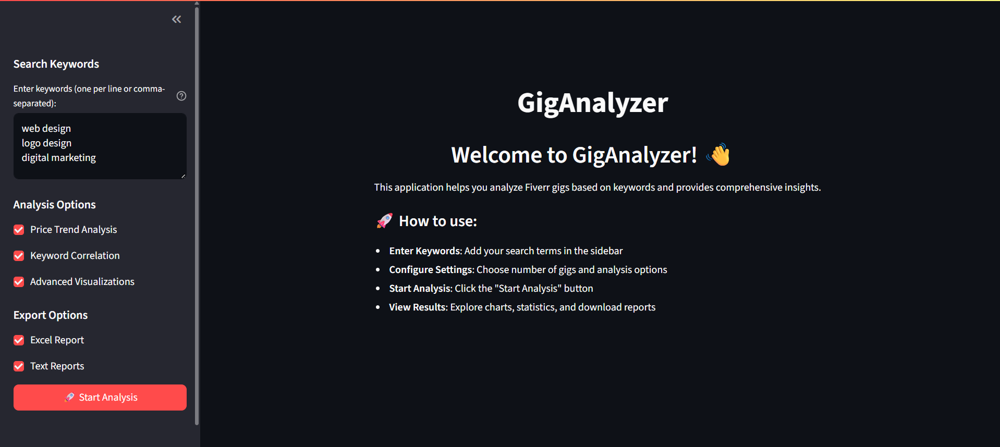

# GigAnalyzer

GigAnalyzer allows users to search for gigs on the Fiverr platform based on a specified keyword. It utilizes web scraping techniques to extract gig details such as title, number of orders, price, and tags from the search results.

## Preview

[](https://drive.google.com/file/d/1XsVbMcz_0HpYeaPSG3dO0LLb0fU6aYyS/view)

[Live](https://giganalyzer.streamlit.app/)

## Requirements

[Install Python on Your Device](https://www.python.org/downloads/)

## Environment Variables

```sh
GOOGLE_API_KEY = AIabcdefghijklmnopqrstuvwxyz
```

## How to run

```shell
# Clone the repository
git clone https://github.com/makmodol1173/GigAnalyzer.git
cd GigAnalyzer

# Install required module
pip install -r requirements.txt

# Run the app
python main.py
```

## Features

### Keyword Analysis

- **Frequency Analysis**: Most commonly used keywords
- **Correlation Detection**: Keywords that appear together
- **Unique vs Duplicate**: Distribution of keyword usage
- **Success Keywords**: Tags associated with high-performing gigs

### Price Analysis

- **Distribution Charts**: Visual representation of pricing patterns
- **Price vs Performance**: Correlation between pricing and completed orders

### Success Metrics

- **Performance Indicators**: High-order, high-rating gigs
- **Success Rate Calculation**: Percentage of successful gigs
- **Category Performance**: Success rates by service category
- **Common Success Factors**: Patterns in successful gigs

### Export Options

- **Excel:** All the fetch gig details with `title`, `description`, `price`, `tags` attribute.
- **Text:** Comma seperated unique keyword.

### AI Recommendation
- Generate a SEO optimized title, description and tags.
## Customization

The application currently uses mock data. To integrate real scraping:

Modify `data_fetcher.py`:

- Implement API integrations (Fiverr, Upwork, etc.)
- Add web scraping capabilities
- Handle rate limiting and authentication

## Contribution Ideas

1. Implement web scrapping resolving policy issue
2. Include seller level, rating, resonse time, delivary time etc in gig details
3. Download ai recommended description as `.txt` file
